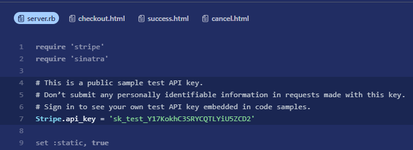
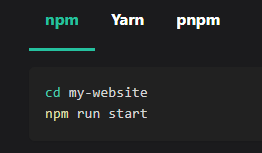

# WYSIWYG Editor Exploration

This project is an exploration into the world of "what you see is what you get" editors. The objective would be to create a documentation solution that allows developers and editors to use their IDE of choice or the browser to write the content.

## Goals

### Stick to plain Markdown syntax

Markdown is great for writing content in an IDE and it is independent from the UI if you stick to common syntax. MDX is great but it will introduce framework-specific syntax into the content over time. I think [Markdown directives](https://github.com/remarkjs/remark-directive) provide a suitable alternative.

### Provide an option to create complex elements like code tabs

Modern documentation will usually display different code snippets depending on the selected code language or an option to switch between snippets in the same code block. It should be possible to define these code tabs in the Markdown file and create and edit them in the browser.

e.g.



### Store the documentation content in a database

The whole user-centric application should be a CMS so we will need to store the documentation content in a database. Bundling all documentation content during a build step was never quite scalable in my experience. Especially projects that want to provide minor version-specific content will produce a lot of pages that don't change that often.

### Syncing the database and local content

Changes made to the database through the browser editor should also be available for the local content. This could mean that the database changes are also applied to the correct local files stored in a git repo. I see a potential for conflicts here since changes from different sources need to be merged. Could be possible that this needs to rely on PRs to avoid merge conflicts and missing content.

### Nested content

The content for product documentation can be quite complex if different teams are involved or content is spread across multiple locations. It should be possible to import the content of a Markdown file into a different file and still be able to edit the original file in the browser.

## Project

### Development

This project relies on a fork of [remark-slate-transformer](https://github.com/alanuecker/remark-slate-transformer) that adds support for directives.

#### remark-slate-transformer

1. Clone `alanuecker/remark-slate-transformer` into `packages/remark-slate-transformer`
2. `npm install`
3. `npm run build`
4. `yarn link`

#### WYSIWYG Editor

Install dependencies:

```sh
yarn link remark-slate-transformer
yarn
```

Install SQLite

Ubuntu

```sh
sudo apt update
sudo apt install sqlite3
```

```sh
yarn setup
```

Migrating Prisma to new schema

```sh
prisma migrate dev --name <enter name for migration>
```

Start project:

```sh
yarn dev
```

### Deployment

First, build your app for production:

```sh
yarn run build
```

Then run the app in production mode:

```sh
yarn start
```

## Learning

### Problems I ran into with different WYSIWYG packages:

1. `MDXEditor`: Nested editors are buggy when it comes to updates. Especially code blocks don't work well.
2. `TipTap`: `ReactNodeViewRenderer` will create portals that are not probably nested. That means that context does not work. Also screws with component frameworks that all use Context.
3. `Plate`: plugin system is quite cumbersome to setup and the data type names did not match with `Slate` which broke the transformer.

### Biome

I tried to give [Biome](https://biomejs.dev/) a chance since I like linters that also format the code but it just didn't feel quite right while using it. It was quite easy to setup but the VSCode integration stopped working after an update. I switched back to ESLint and Stylelint with the Prettier integration for formating.
